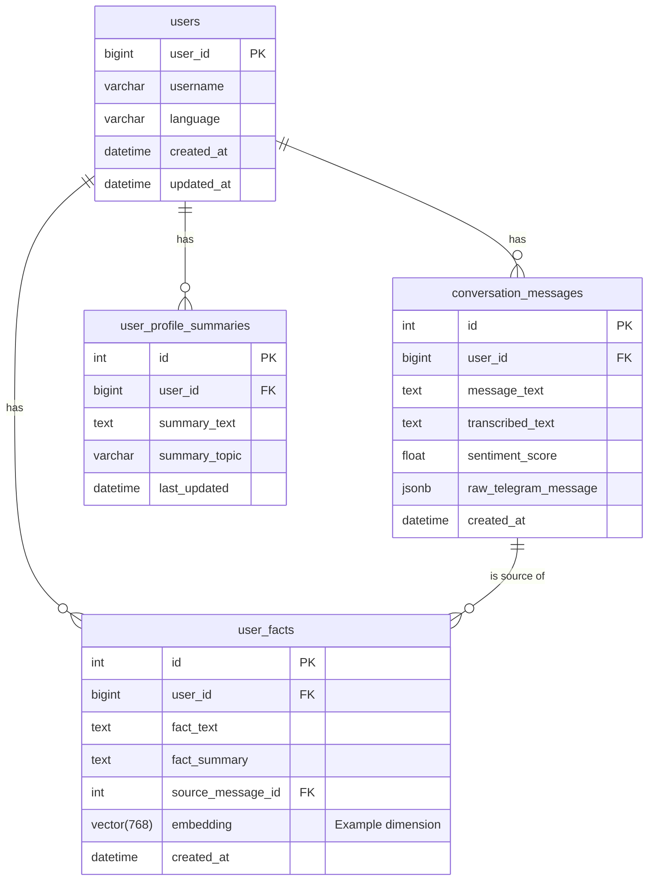

# Architectural Plan: AI Language Companion Telegram Bot

This document outlines the architecture for a sophisticated Telegram bot designed to build long-term user relationships through voice conversations, emotional understanding, and personalized memory.

## 1. High-Level Architecture

The system is designed as a modular, asynchronous application. The data flows from the user's voice message through several services before a synthesized voice response is returned.

```mermaid
graph TD
    subgraph User
        A[User on Telegram]
    end

    subgraph Bot Infrastructure
        B[Telegram Bot Server]
        C[Audio Processing Service]
        D[NLP & Logic Core]
        E[Data Access Layer (DAO)]
        F[Language Model (LLM)]
        G[RAG Service]
    end

    subgraph External Services
        H[ElevenLabs API (TTS)]
        I[OpenAI Whisper API (STT)]
    end

    subgraph Database
        J[PostgreSQL Database]
        K[Vector Store (pgvector)]
    end

    A -- Voice Message --> B
    B -- Audio File --> C
    C -- STT Request --> I
    I -- Transcribed Text --> C
    C -- Transcribed Text --> D
    D -- Text for Analysis --> G
    D -- User ID --> G
    G -- Query Embeddings --> K
    K -- Relevant Facts --> G
    G -- Retrieved Context --> D
    D -- Formatted Prompt --> F
    F -- Text Response --> D
    D -- Text to Synthesize --> C
    D -- Emotional Context --> C
    C -- TTS Request --> H
    H -- Synthesized Audio --> C
    C -- Audio File --> B
    B -- Voice Message --> A
    
    D -- Data to Save --> E
    E -- CRUD Operations --> J
    G -- Embeddings to Save --> K

```

**Flow Description:**
1.  The user sends a voice message to the **Telegram Bot**.
2.  The bot's **Audio Processing Service** sends the audio to a **Speech-to-Text (STT)** service (like OpenAI's Whisper) to get the transcript.
3.  The transcript is passed to the **NLP & Logic Core**.
4.  The Core's **RAG Service** retrieves relevant memories and facts for this user from the **PostgreSQL Vector Store**.
5.  The Core combines the transcript and retrieved context into a prompt for the **Language Model (LLM)**.
6.  The LLM generates a text response.
7.  The NLP Core sends this text response and emotional cues to the **Audio Processing Service**.
8.  It calls the **ElevenLabs API (TTS)** to convert the text into emotionally-aware speech.
9.  The resulting audio file is sent back to the user via the Telegram Bot.
10. In parallel, the NLP Core extracts important facts from the conversation, which are stored in the database via the **Data Access Layer**.

## 2. Core Components Breakdown

*   **Audio Processing Service:**
    *   **Speech-to-Text (STT):** Manages transcription of incoming voice messages. We'll integrate a robust service like OpenAI's Whisper for high accuracy. A new configuration key, `OPENAI_API_KEY`, will be needed.
    *   **Text-to-Speech (TTS):** Manages the synthesis of voice responses using the ElevenLabs API. It will take text and emotional hints (e.g., 'happy', 'calm') to generate expressive audio. We'll need an `ELEVENLABS_API_KEY` in the configuration.

*   **Data Access Layer (DAO Pattern):**
    *   The existing `DatabaseManager` will be refactored to handle only connection pooling.
    *   We will introduce a new `dao` directory.
    *   DAO classes (`UserDAO`, `MessageDAO`, `UserFactDAO`) will encapsulate all SQL queries for their respective models, ensuring a clean separation of concerns.

*   **NLP & Logic Core:**
    *   **Emotion Analysis Service:** Performs text-based sentiment analysis on the user's transcribed message to gauge their emotional state (e.g., positive, neutral, negative).
    *   **Information Extraction Service:** A critical component. After a conversation, this service uses an LLM call to a) classify if the information is important (memory, fact, event) and b) summarize it for storage in the RAG.
    *   **Conversation Manager:** The central orchestrator that manages the state of the conversation and directs the flow between all other services.

*   **RAG (Retrieval-Augmented Generation) Service:**
    *   **Vector Database:** We will use the `pgvector` extension for PostgreSQL. This allows us to store text embeddings (vectors) directly in our main database.
    *   **Fact Ingestion:** When the Information Extraction Service identifies a new fact, the RAG service will use a sentence-transformer model to convert the fact into a vector embedding and store it in the `user_facts` table.
    *   **Context Retrieval:** Before prompting the LLM, this service will convert the incoming user message into an embedding and perform a similarity search in the `user_facts` table to find the most relevant past memories for that user.

## 3. Database Schema Design

We'll extend the database with new tables to support the required features.



*   **`users`**: The existing table.
*   **`conversation_messages`**: Stores a complete log of interactions, including transcripts and sentiment scores.
*   **`user_facts`**: The heart of the RAG system. Stores individual pieces of knowledge as text and as a searchable vector.
*   **`user_profile_summaries`**: Holds high-level summaries about the user, generated periodically from the RAG data, for quick reference.

## 4. Proposed Project Structure

We will add new directories and files to the existing structure to keep the codebase organized and scalable.

```
telegram_bot_template/
├── ... (existing files)
├── dao/
│   ├── __init__.py
│   ├── base_dao.py
│   ├── user_dao.py
│   ├── message_dao.py
│   └── user_fact_dao.py
├── services/
│   ├── __init__.py
│   ├── audio_service.py   # Handles STT and TTS
│   ├── nlp_service.py       # Handles Emotion & Info Extraction
│   └── rag_service.py       # Manages RAG logic & vector interactions
└── handlers/
    ├── ... (existing handlers)
    └── voice_handler.py     # New handler dedicated to voice messages
```

## 5. Implementation Plan

A phased approach to build this complex system, ensuring we have a working product at each stage.

*   **Phase 1: Core Voice & Database Foundation**
    1.  Set up PostgreSQL with the `pgvector` extension.
    2.  Refactor the database layer to use the DAO pattern.
    3.  Implement the `AudioService` with basic STT (Whisper) and TTS (ElevenLabs) integration.
    4.  Create the `voice_handler` to simply transcribe, echo the text back, and then read the text response aloud.

*   **Phase 2: Building the RAG Brain**
    1.  Implement the `RAGService` for fact ingestion and retrieval.
    2.  Implement the `InformationExtractionService` to identify and save important facts to the database.
    3.  Integrate the RAG context into the LLM prompt.

*   **Phase 3: Adding Empathy**
    1.  Implement the `EmotionAnalysisService`.
    2.  Use the sentiment score to add emotional context to the LLM prompt.
    3.  Pass emotional cues to the ElevenLabs API to generate expressive speech.

*   **Phase 4: Refinement & Advanced Features**
    1.  Develop the `user_profile_summaries` feature.
    2.  Fine-tune the RAG retrieval and information extraction models.
    3.  Explore more advanced voice emotion analysis as a future enhancement.